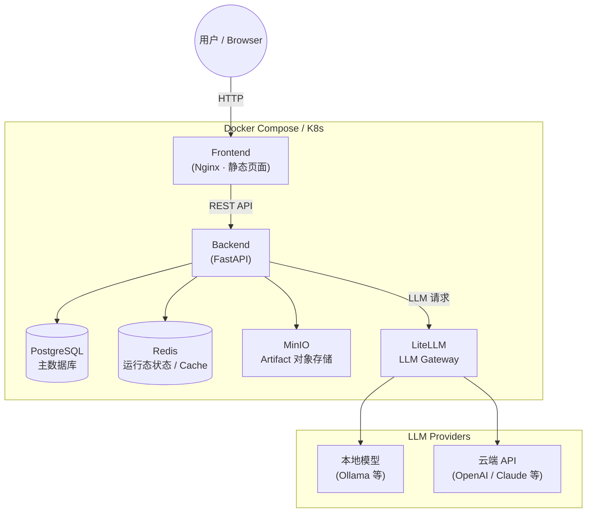

# Traceable Execution Platform

## Overview

一个从零构建的后端平台，覆盖从基础 CRUD、分布式存储到云原生部署的完整技术栈，并预留 AI Infra 扩展方向。

- **Traceable Workflow** — 以 Ticket → Run → Artifact 为核心链路，每次执行都有完整的上下文记录和 append-only Audit Log，操作全程可追溯、不可抵赖
- **分布式存储** — PostgreSQL 主数据库，Redis 管理运行态状态，MinIO 提供 S3-compatible Artifact 对象存储
- **云原生部署** — 支持 Docker Compose 一键启动，提供完整 Kubernetes manifest，含 Ingress 和多节点集群配置
- **LLM Infra** — 通过 LiteLLM Gateway 统一接入本地模型（Ollama）和云端 API（OpenAI / Claude 等），provider 可插拔替换

## Tech Stack（技术栈）

| 层级                 | 技术 |
|--------------------|------|
| Backend            | Python · FastAPI · SQLAlchemy · Alembic · Pydantic |
| Database           | PostgreSQL |
| Cache / 运行态状态      | Redis |
| Object Storage     | MinIO（S3-compatible） |
| LLM Proxy          | LiteLLM |
| Frontend           | 原生 HTML / JS · Nginx |
| Orchestration / 编排 | Kubernetes · Kind（本地多节点集群） · Nginx Ingress Controller |
| 容器化                | Docker · Docker Compose |
| Auth               | JWT（JSON Web Token） |

## Architecture（系统架构）



## Quick Start（快速启动）

### 前置要求

确保本地已安装 [Docker](https://docs.docker.com/get-docker/) 和 Docker Compose。

### 第一步：准备环境变量

```bash
cp .env.example .env
```

### 第二步：启动所有服务

一条命令拉起全部依赖：PostgreSQL、Redis、MinIO、LiteLLM、Backend、Frontend。

```bash
cd docker
docker compose up -d
```

首次启动需要拉取 image，稍等片刻。用以下命令确认 backend 已就绪：

```bash
docker compose logs -f backend
# 看到 "🚀 Starting Traceable Execution Platform" 即为成功
```

### 第三步：初始化数据库（仅首次）

```bash
# 执行 Alembic migration，创建所有数据库表
docker compose exec backend alembic upgrade head

# 创建默认用户
docker compose exec backend python scripts/init_db.py
```

默认账户：

| 角色 | username | password |
|------|----------|----------|
| admin（管理员） | `admin` | `admin123` |
| employee（员工） | `employee` | `employee123` |

### 访问服务

| 服务 | 地址 |
|------|------|
| Frontend | http://localhost:3000 |
| Swagger UI（API 文档） | http://localhost:8000/api/v1/docs |
| MinIO Console | http://localhost:9001 |

## Advanced Setup（进阶配置）

### Custom Configuration（本地自定义配置）

Quick Start 使用的 `.env` 默认值适合快速体验。如需自定义，编辑项目根目录的 `.env` 文件：

```bash
# 安全（生产环境必改）
SECRET_KEY=your-secret-key-min-32-chars

# LLM Gateway
LITELLM_BASE_URL=http://localhost:4000
LITELLM_MASTER_KEY=sk-master

# Artifact 存储类型：local | minio
ARTIFACT_STORAGE_TYPE=minio
```

LiteLLM 的模型路由配置在 `docker/litellm-config.yaml`，可在此添加本地模型（Ollama 等）或云端 API（OpenAI、Claude 等）：

```yaml
model_list:
  - model_name: local-mistral
    litellm_params:
      model: ollama/mistral
      api_base: http://host.docker.internal:11434
  # 继续添加更多 provider...
```

本地开发模式（不使用 Docker 运行 backend）请参考 `run_local.sh`。

---

### Deployment with Kubernetes

项目提供完整的 Kubernetes manifest，位于 `k8s/` 目录，包含 Backend、PostgreSQL、Redis、MinIO、LiteLLM 和 Nginx Ingress。

**前置要求：** 安装 [Kind](https://kind.sigs.k8s.io/) 和 `kubectl`。

**第一步：创建本地集群**

```bash
kind create cluster --config cluster/kind/kind-multi-node.yaml
```

这会创建一个 1 control-plane + 2 worker 的本地集群。

**第二步：安装 Nginx Ingress Controller**

```bash
kubectl apply -f https://raw.githubusercontent.com/kubernetes/ingress-nginx/main/deploy/static/provider/kind/deploy.yaml
```

**第三步：准备 Secret**

```bash
# 以 backend 为例，其他组件同理
cp k8s/backend/secret.yaml.example k8s/backend/secret.yaml
cp k8s/minio/secret.yaml.example k8s/minio/secret.yaml

# 编辑 secret.yaml，填入真实的 SECRET_KEY、数据库密码等
```

**第四步：部署所有资源**

```bash
kubectl apply -R -f k8s/
```

**确认部署状态：**

```bash
kubectl get pods
kubectl get ingress
```

所有 Pod 变为 `Running` 后，访问 http://localhost 即可。
