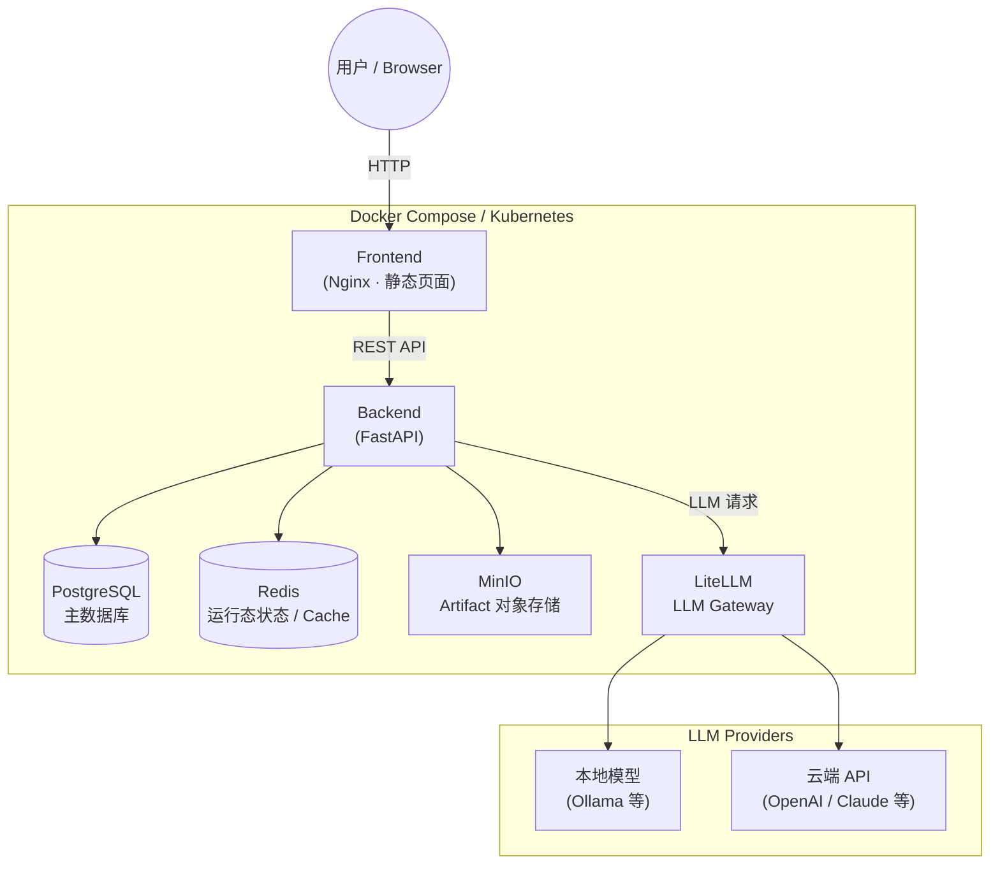

# Traceable Execution Platform

一个**可追溯、可还原、受控执行**的后端平台，用于管理工单（Ticket）和执行记录（Run），确保操作的完整审计链（Audit Trail）。

## Tech Stack（技术栈）

| 层级                 | 技术 |
|--------------------|------|
| Backend            | Python · FastAPI · SQLAlchemy · Alembic · Pydantic |
| Database           | PostgreSQL |
| Cache / 运行态状态      | Redis |
| Object Storage     | MinIO（S3-compatible） |
| LLM Proxy          | LiteLLM |
| Frontend           | 原生 HTML / JS · Nginx |
| Orchestration / 编排 | Kubernetes · Kind（本地多节点集群） · Nginx Ingress Controller |
| 容器化                | Docker · Docker Compose |
| Auth               | JWT（JSON Web Token） |

## Architecture（系统架构）



## Quick Start

### 前置要求

确保本地已安装 [Docker](https://docs.docker.com/get-docker/) 和 Docker Compose。

### 第一步：准备环境变量

```bash
cp .env.example .env
```

### 第二步：启动所有服务

一条命令拉起全部依赖：PostgreSQL、Redis、MinIO、LiteLLM、Backend、Frontend。

```bash
cd docker
docker compose up -d
```

首次启动需要拉取 image，稍等片刻。用以下命令确认 backend 已就绪：

```bash
docker compose logs -f backend
# 看到 "🚀 Starting Traceable Execution Platform" 即为成功
```

### 第三步：初始化数据库（仅首次）

```bash
# 执行 Alembic migration，创建所有数据库表
docker compose exec backend alembic upgrade head

# 创建默认用户
docker compose exec backend python scripts/init_db.py
```

默认账户：

| 角色 | username | password |
|------|----------|----------|
| admin（管理员） | `admin` | `admin123` |
| employee（员工） | `employee` | `employee123` |

### 访问服务

| 服务 | 地址 |
|------|------|
| Frontend | http://localhost:3000 |
| Swagger UI（API 文档） | http://localhost:8000/api/v1/docs |
| MinIO Console | http://localhost:9001 |

